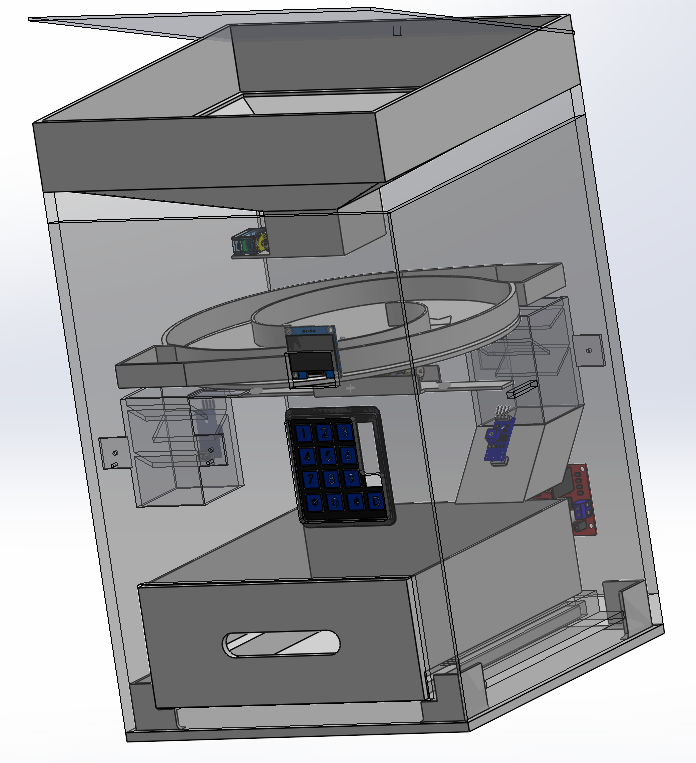
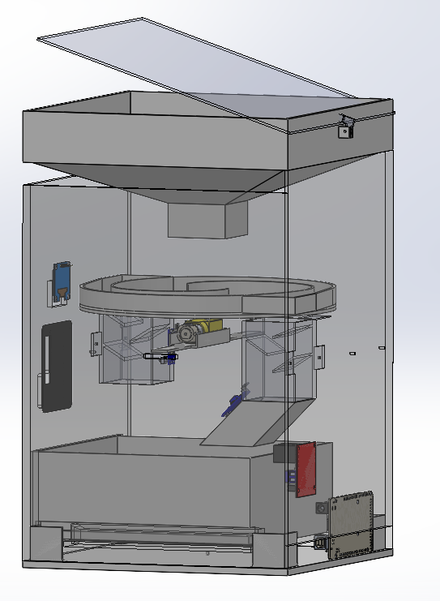

# 🔢 Sistema Automatizado de Conteo de Piezas 1x1 cm

## 📌 Descripción

Este proyecto consiste en el diseño y desarrollo de un **sistema automatizado para el conteo de piezas pequeñas (1 cm x 1 cm)**, utilizando un mecanismo mecánico de alimentación y un sistema electrónico basado en microcontrolador.

El sistema integra una **tolva de alimentación**, una **base giratoria de distribución** y un **sensor de conteo por paso**, permitiendo realizar conteos precisos de manera eficiente y continua.

---

## 🎯 Objetivos del sistema

* Automatizar el conteo de piezas pequeñas
* Reducir errores humanos en procesos manuales
* Diseñar una solución de bajo costo

---

## 🧠 Concepto de funcionamiento

El sistema opera en tres etapas principales:

1. **Alimentación (Tolva)**
   Las piezas ingresan de forma aleatoria a través de una tolva.

2. **Distribución (Base giratoria)**
   Un mecanismo rotatorio organiza las piezas, evitando acumulaciones y permitiendo un flujo controlado.

3. **Conteo (Sensor de paso)**
   A medida que las piezas caen individualmente, un sensor detecta cada paso y envía la señal al sistema de control.

---

## ⚙️ Arquitectura del sistema

### 🔧 Componentes principales

* Tolva de alimentación
* Base giratoria (mecanismo de ordenamiento)
* Sensor de paso (óptico )
* Microcontrolador ATmega2560
* Sistema de visualización ( display)
* Fuente de alimentación

---

## 🔌 Funcionamiento electrónico

El microcontrolador procesa las señales provenientes del sensor de paso, incrementando un contador cada vez que se detecta una pieza.

El sistema puede ser configurado para:

* Conteo continuo
* Conteo por lotes
* Reinicio automático o manual

---

## 🛠️ Diseño mecánico

El diseño mecánico está orientado a:

* Facilitar el flujo continuo de piezas
* Evitar atascos
* Garantizar una correcta alineación antes del conteo

---

## 📂 Archivos incluidos

* Modelos 3D (Carpeta Modelos 3D
* Renderizados del diseño (Carpeta Imagenes)

---

## 🚀 Autor

Miguel Hernández

---

## 📎 Notas

Este proyecto es una propuesta propia orientada a una solucion de un problema académico, enfocada en mejorar procesos de conteo mediante automatización.
